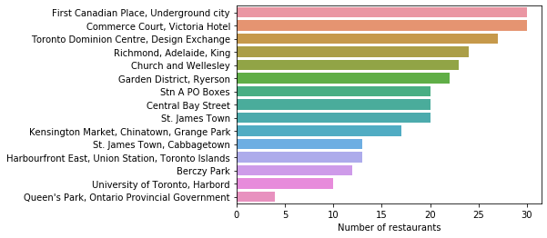
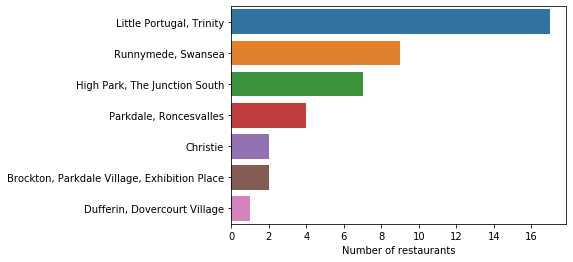
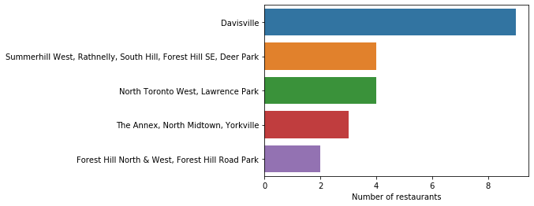
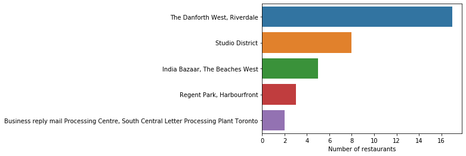

# BEST RESTAURANT LOCATION IN TORONTO
Cousera capstone project
## Table of contents
* [Introduction: Business Problem](#introduction)
* [Data](#data)
* [Methodology](#methodology)
* [Analysis](#analysis)
* [Results and Discussion](#results)
* [Conclusion](#conclusion)

## Introduction: Business Problem 
Determining the best neighborhoods to open a restaurant in Toronto. This would be where restaurants are not concentrated. The solution to this problem would help investors interested in opening restaurants to decide where their business could thrive the most

## Data
Based on definition of our problem, factors that will influence our decision are:
* Neighborhoods in Toronto
* number of existing restaurants in the neighborhood 
* location existing restaurants in the neighborhood 

The following data sources will be needed to extract/generate the required information:
* neighborhoods in Toronto:  https://en.wikipedia.org/wiki/List_of_postal_codes_of_Canada:_M,
* coordinates of neighborhoods in Toronto: http://cocl.us/Geospatial_data
* number of restaurants and their type and location in every neighborhood will be obtained using **Foursquare API**

## Methodology 
The Kmeans clustering would be used to group the restaurants based on their closeness to each other. The numbers of resturants in each neighborhoods would then be determined. The restaurants in Toronto using foursquare API

## Results and Discussion 

Now, we can visualize the numbers of restaurants the neighborhoods in each clusters and decide that the best place to build a restaurant are where the number of existing restaurants are less than 5.

#### First cluster

In this Cluster, there are many restaurants, a good neighborhood to build a restaurant would be Queen's Park, Ontario Provincial Government

#### Second cluster

There isn't many restaurants in this cluster, the following are best neighborhoods to build a restaurant:

* Dufferin, Dovercourt Village
* Brockton, Parkdale Village, Exhibition Place
* Christie
* Parkdale, Roncesvalles

#### Third cluster

There isn't many restaurants in this cluster also, the following are best neighborhoods to build a restaurant:

* Forest Hill North & West, Forest Hill Road Park
* The Annex, North Midtown, Yorkville
* North Toronto West Lawrence Park
* Summerhill West

#### Forth Cluster

There isn't many restaurants in this cluster also, the following are best neighborhoods to build a restaurant:

* Business reply mail Processing Center
* Regent Park
* India Bazaar

## Conclusion 

In conclusion, the restaurants in Toronto have been grouped into four clusters. There are quite a number of restaurants in the first cluster, hence it wont be wise to set up a new restaurant there. The remaining clusters have few restaurants and as a result would be good locations to set up a new restaurants.

